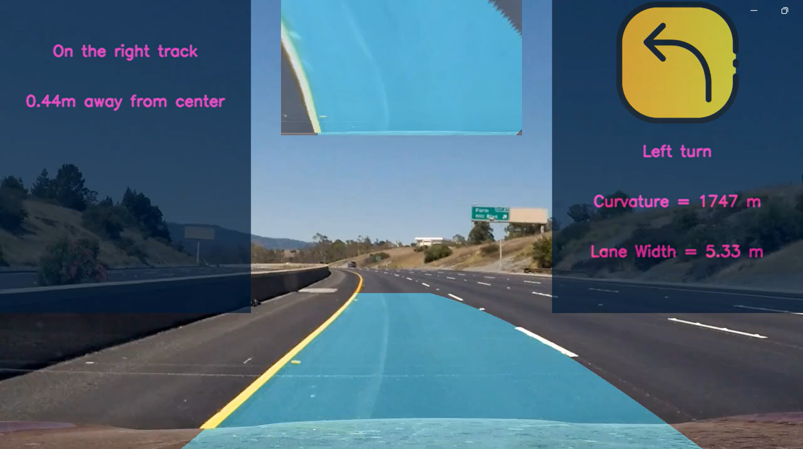

## Advanced Lane Detection

The Lane Detection system is designed to enhance vehicle safety by providing real-time feedback on lane position, lane curvature, visibility, speed limits and vehicles detection. Using image processing techniques, this system detects lane lines and generates visual and textual warnings to assist drivers in maintaining proper lane discipline.



The Project
---

The steps of this project are the following:

* Compute the camera calibration matrix and distortion coefficients given a set of chessboard images.
* Apply a distortion correction to raw images.
* Apply a perspective transform to rectify binary image ("birds-eye view").
* Use color transforms, gradients, etc., to create a thresholded binary image.
* Detect lane pixels and fit to find the lane boundary.
* Determine the curvature of the lane and vehicle position with respect to center.
* Warp the detected lane boundaries back onto the original image.
* Lane Width: Computes the width of the lane based on polynomial coefficients.
* Lane Visibility: Indicates whether the lane visibility is clear or poor.
* Departure Warning: Alerts the driver if the vehicle is departing from its lane.
* Output visual display of the lane boundaries and numerical estimation of lane curvature and vehicle position.

The images for camera calibration are stored in the folder called `camera_cal`.  The images in `test_images` are for testing your pipeline on single frames. 


### Requirements
```bash
pip install -r requirements.txt
```

### Run 
```bash
python main.py INPUT_IMAGE OUTPUT_IMAGE_PATH
python main.py --video INPUT_VIDEO OUTPUT_VIDEO_PATH
```
